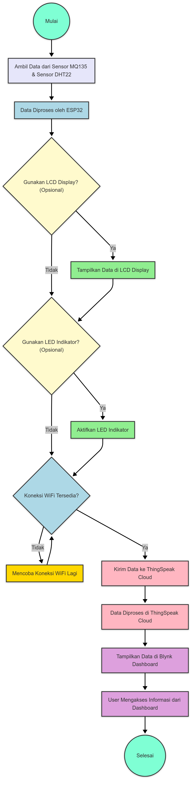

# air-quality-monitoring-system

Sebagai bagian dari tugas besar mata kuliah IoT, proyek ini berfokus pada pemantauan kualitas udara menggunakan teknologi sensor. Data yang dikumpulkan akan dikirim ke cloud agar dapat diakses secara online. Proyek ini mendasari tujuan pembangunan berkelanjutan, yaitu SDG 11: **Sustainable Cities and Communities.**

## 🔄 Tujuan Proyek

- Melakukan pengukuran kualitas udara, suhu, dan kelembaban melalui sensor MQ135 dan DHT22.
- Memberikan akses informasi kualitas udara secara real-time.
- Mengirim data hasil pengukuran ke cloud (ThingSpeak) secara otomatis dan berkala.
- Menyediakan visualisasi data menggunakan platform seperti Grafana.

## 🧰 Komponen yang Digunakan

| Komponen     | Fungsi                                                  |
|--------------|-----------------------------------------------------------|
| ESP32        | Unit mikrokontroler utama + WiFi                          |
| MQ135        | Sensor untuk mendeteksi kualitas udara                    |
| DHT22        | Sensor suhu dan kelembaban                                |
| Potensiometer (jika menggunakan LCD) | Mengatur tingkat kontras tampilan pada LCD               
| LCD (opsional) | Tampilan langsung di perangkat                 |
| 3 LED (opsional) | Indikator visual untuk status udara                   |
| Breadboard   | Media perakitan sirkuit sementara                         |
| Kabel Jumper | Penghubung antar komponen                                 |
| ThingSpeak   | Platform penyimpanan dan pengiriman data berbasis cloud   |
| Blynk      | Alat untuk visualisasi data dalam bentuk grafik           |

## 🗂️ Diagram Blok Sistem (Flowchart)

 

Lokasi : images/FlowchartIOT.png

## Lisensi

Kelompok 13 :
- Muhammad Zaky Tabrani (105222025)
- Felix Joshua Paulus (105222032)

