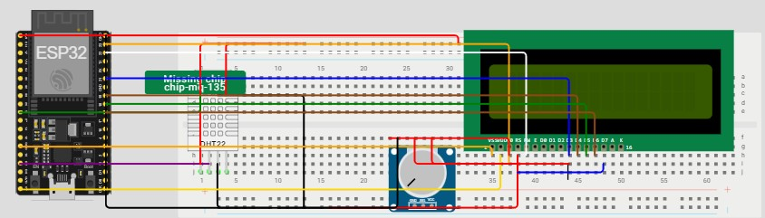
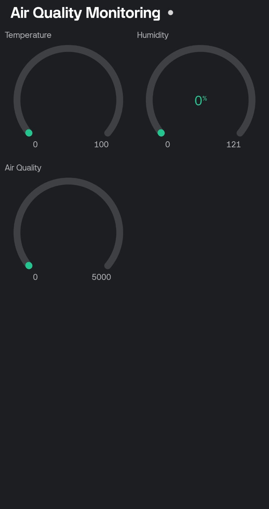
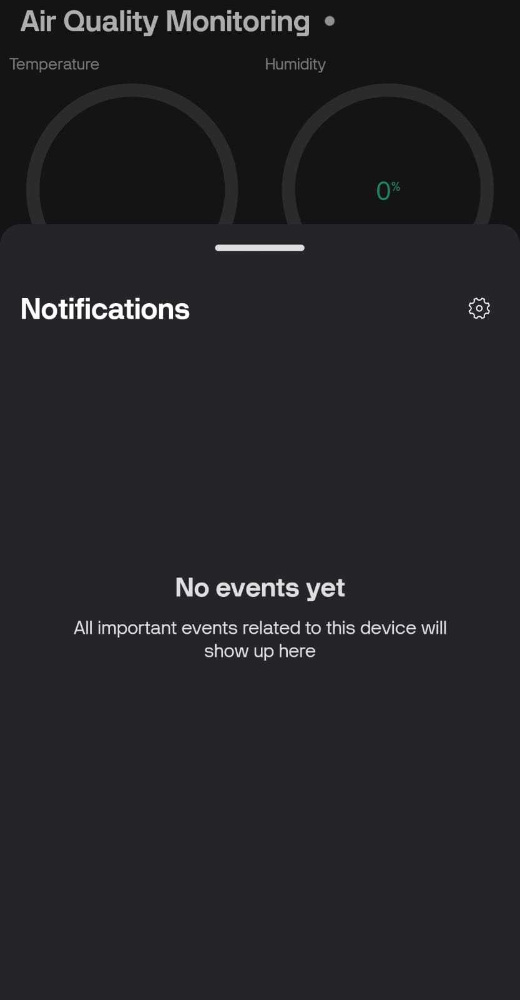
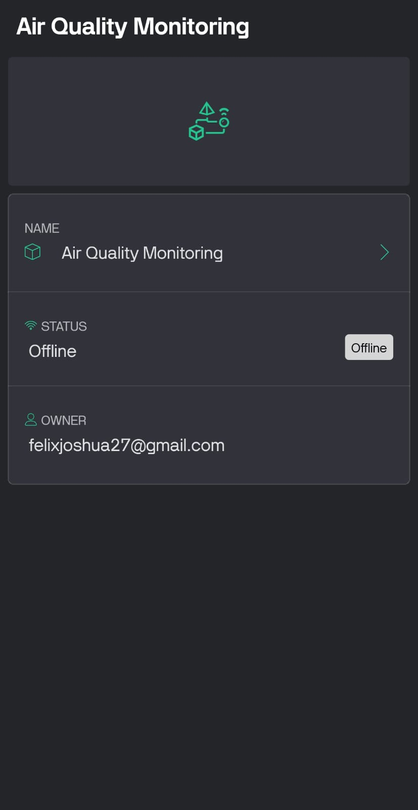

# Desain Hardware (Wokwi)

**Keterangan**: Wokwi tidak memiliki komponen MQ-135, sehingga diganti oleh chip breakout yang penamaannya bisa diatur.

---

# Desain Software (Blynk)

## Tampilan Awal

---

## Notifikasi

---

## Info Aplikasi

